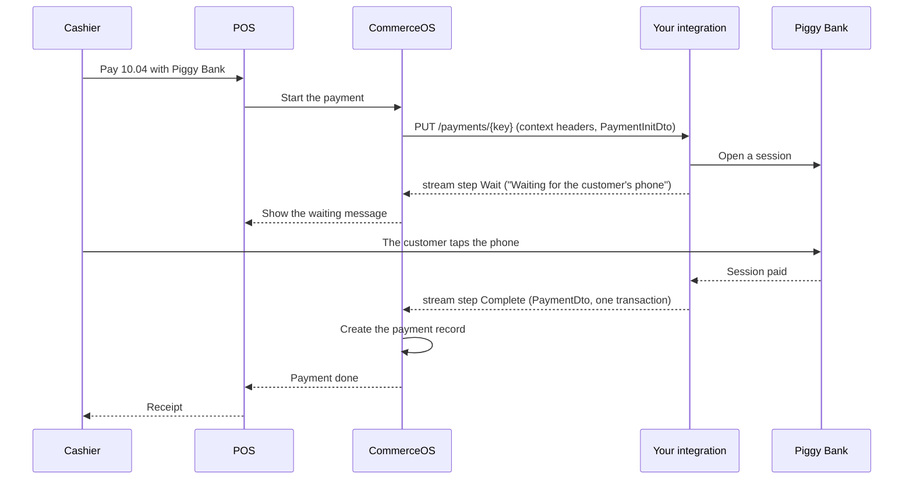
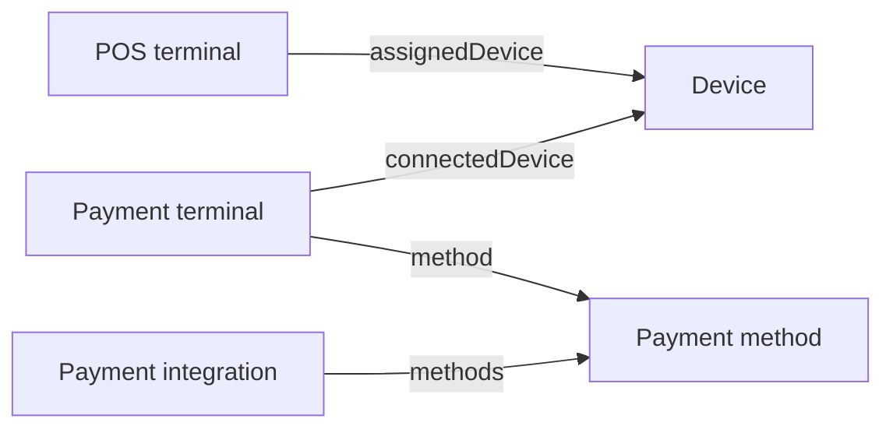

# Build a payment integration

A payment integration is the HTTP service that you build so that CommerceOS can take, capture,
release and refund payments through your provider. It follows the payment EPI (External Partner
Interface), which is the Heads specification of the calls between CommerceOS and your service.
This page gets you from nothing to a working integration in one sitting. The contract is in
[Payment EPI reference](./payment-epi/reference.md).

**Base URL:** `https://example.app.heads.com/api/v1`
**API Key:** `banana` (passed via Basic Auth with empty username: `-u ":banana"`)

> **See also:** [Examples Index](../examples.md) | [Configuration](./configuration.md) § EPI Integrations

---

## 1. The picture

One sale, paid with a phone tap, from the cashier to the receipt.



CommerceOS starts every payment with one HTTP call to your integration. The response is not one JSON body.
It is a stream of steps, one per line of progress. A `Wait` step tells the cashier what happens. A
`Complete` step ends the stream with the money that moved. CommerceOS turns each transaction of that
step into a payment record on the payment order. The receipt then closes. Your integration never calls the
POS, and the POS never calls your integration. Everything goes through CommerceOS, and your integration talks to your own provider in between. Four more flows: [flows](./payment-epi/flows.md).

## 2. Ten minutes

Piggy Bank is a sample integration in four files, Node 22, no dependencies. Clone the repository and
start it.

```bash
git clone https://github.com/ByHeads/commerceos-api-reference.git
cd commerceos-api-reference/guide/examples/payment-epi/sample
node server.mjs
# Piggy Bank integration at http://127.0.0.1:8787/piggy (tap and cancel window 3000 ms)
```

In a second terminal, play the CommerceOS side. The play script installs the integration, reads the
methods, and starts one payment. It prints every step of the stream.

```bash
node play.mjs 10.00
# Method com.example.piggy (Piggy Bank)
# → Complete {"result":{"processorsId":"PB-mucmciak-1","methodId":"com.example.piggy","amount":"10.00","currencyCode":"SEK","transactions":[{"transactionId":"PB-mucmciak-2","actions":["Authorize","Debit"],"amount":"10.00","currencyCode":"SEK","methodId":"com.example.piggy","token":"tok-10.00","specification":[{"identifier":"ART-0001","description":"Sample article","quantity":"1","unit":"pcs","totalAmount":"10.00","vatPercentage":"25","currencyCode":"SEK"}],"timestamp":"2026-09-22T11:56:50.454Z","means":{"type":"Singleton","id":"Piggy Bank"}}]}}
# transactionId  actions          amount  currencyCode  token      timestamp
# -------------  ---------------  ------  ------------  ---------  ------------------------
# PB-mucmciak-2  Authorize+Debit  10.00   SEK           tok-10.00  2026-09-22T11:56:50.454Z
```

Every id the bank hands out starts with a prefix that changes on each start, because CommerceOS
requires a `processorsId` to be unique per method for all time. Now the sale from the picture. An
amount that ends in `.04` waits for the customer's phone. Start the server with a longer window, so
that you can tap by hand.

```bash
PIGGY_WAIT_MS=60000 node server.mjs      # first terminal
node play.mjs 10.04                      # second terminal
# Method com.example.piggy (Piggy Bank)
# → Wait {"message":"Waiting for the customer's phone","params":["PB-mucmciak-3"]}
#   tap:    curl -X POST http://127.0.0.1:8787/piggy/tap/PB-mucmciak-3
```

Run the tap command from a third terminal. The stream completes.

```bash
curl -X POST http://127.0.0.1:8787/piggy/tap/PB-mucmciak-3
# → Complete {"result":{"processorsId":"PB-mucmciak-3","methodId":"com.example.piggy","amount":"10.04","currencyCode":"SEK","transactions":[{"transactionId":"PB-mucmciak-4","actions":["Authorize","Debit"],"amount":"10.04","currencyCode":"SEK","methodId":"com.example.piggy","token":"tok-10.04","specification":[{"identifier":"ART-0001","description":"Sample article","quantity":"1","unit":"pcs","totalAmount":"10.04","vatPercentage":"25","currencyCode":"SEK"}],"timestamp":"2026-09-22T11:56:53.521Z","means":{"type":"Singleton","id":"Piggy Bank"}}]}}
# transactionId  actions          amount  currencyCode  token      timestamp
# -------------  ---------------  ------  ------------  ---------  ------------------------
# PB-mucmciak-4  Authorize+Debit  10.04   SEK           tok-10.04  2026-09-22T11:56:53.521Z
```

The server log adds `kv pay-... not written`: the bank records the waiting session in the CommerceOS
key-value store, and no CommerceOS runs on your machine. `--cos` starts a stand-in for that side. It
answers the token endpoint, the configuration behind a context id and the key-value store, and every
call to it shows as a `[cos]` line:

```bash
node play.mjs 10.04 --cos
# [cos] POST /oauth2/v1/token 200
# [cos] GET /api/v1/context/config/EPI1 200
# Test: true
# Method com.example.piggy (Piggy Bank)
# [cos] POST /oauth2/v1/token 200
# → Wait {"message":"Waiting for the customer's phone","params":["PB-mucmppuu-1"]}
#   tap:    curl -X POST http://127.0.0.1:8787/piggy/tap/PB-mucmppuu-1
# [cos] PUT /api/v1/kv/com.example.piggy/pay-1790078826817 200
# → Complete {...}
# [cos] POST /oauth2/v1/token 200
# [cos] PUT /api/v1/kv/com.example.piggy/pay-1790078826817 200
```

The first three lines are the configuration round trip: the bank fetches a token with the client it
received at install, reads the configuration behind the context id, checks it against its own
`config-schema`, and answers `true` to `/test`.

## 3. What you build

Ten routes under one base URL. CommerceOS holds that base URL on a *payment integration* record
and appends a fixed path per call. A *bare* call carries no context headers. A *contextful* call
carries the three context headers of the reference, section 3. Reject one that arrives without them
with a 400, on every contextful route including the stream route: CommerceOS always sends them, so
only a caller that is not CommerceOS reaches that answer.
The contract is two OpenAPI 3.1 documents: [`epi-openapi.yaml`](./payment-epi/epi-openapi.yaml) for these ten routes, with every field described and
each operation saying when CommerceOS calls it, and [`commerceos-openapi.yaml`](./payment-epi/commerceos-openapi.yaml) for the calls your integration
makes back. Generate a server stub from the first and a client from the second with your OpenAPI generator.

| Route | Kind | Answers |
|---|---|---|
| `POST /install` | bare | any 2xx. The body holds the OAuth2 client that your integration uses to call CommerceOS back |
| `POST /uninstall` | bare | any 2xx |
| `GET /config-schema` | bare | a form description: the fields that an administrator fills in per store |
| `POST /test` | contextful | JSON `true` |
| `GET /methods` | contextful | the payment methods that you offer, `MethodDto[]`. `configure` copies them into method records; the administrator adds the rest (reference, section 2) |
| `GET /terminals` | contextful | the terminals that this configuration knows, `TerminalDto[]` |
| `GET /terminals/{terminalId}` | contextful | one `TerminalDto` |
| `PUT /payments/{paymentKey}` | contextful | a stream of steps that ends in `Complete`, `Decline`, `Cancel` or `Fail` |
| `POST /payments/{paymentKey}/transactions` | contextful | one `TransactionDto`. Today only a till refund (`Credit`) calls it. The contract also allows a capture or a release |
| `POST /payments/{cancellationToken}/cancel` | contextful | any 2xx. The stream then ends with `Cancel` |

Calls go in two directions, and each direction has its own authentication.

**Your integration calls CommerceOS with an OAuth2 client.** Your integration holds no API key. A
Heads administrator creates a confidential OAuth2 client for the integration and then runs
`install`. CommerceOS sends `cosBaseUrl`, `tokenUrl`, `clientId`, `clientSecret` and `scope` in the
body of `POST /install`. Store them. Your integration gets a client-credentials token from
`tokenUrl` and sends it as a bearer token on every call to CommerceOS. The client is limited to
what an integration needs: the configuration behind a context id, a key-value store for your own
state, and payment orders and payment records, for example to complete a payment that ends
asynchronously (reference, section 8). A second install usually sends the same client again, and it
can carry a new one: always store the client that the latest install sent.

**CommerceOS calls your integration without a credential.** CommerceOS calls your integration for
everything in the table. The three context headers identify the configuration, and nothing
identifies the caller. Protect the endpoint at the network level. How you do that is your choice.

## 4. A tour of the sample

| File | Role |
|---|---|
| `sample/bank.mjs` | the in-memory bank: sessions, a ledger, and `tap(sessionId)` for the customer's phone |
| `sample/server.mjs` | the integration: the ten routes, the header check, the configuration read behind `/test`, the stream, transactions and cancel |
| `sample/play.mjs` | the CommerceOS side: install, methods, one payment, every step printed |
| `sample/cos.mjs` | a stand-in for the calls back: token, the configuration behind a context id, key-value store, payment-order completion |

The header check. Every route below this line is contextful, so one test covers them all.

```js
// Section 3: every call below is contextful. Section 7 gives the error shape.
if (typeof request.headers["x-epi-context-config-id"] !== "string") {
    return json(response, 400, errorBody("Missing X-EPI-Context-Config-Id header"));
}
```

The configuration round trip. `GET /config-schema` declares two fields, `merchantId` and `environment`. An
administrator fills them in, and `POST /test` reads them back through the context id and checks them.
The same helper serves a payment route that needs the merchant id.

```js
async function readConfig(request) {
    const id = request.headers["x-epi-context-config-id"];
    const hash = request.headers["x-epi-context-config-hash"];
    if (hash && configByHash.has(hash)) return configByHash.get(hash);
    const response = await fetch(cosApi(`/context/config/${encodeURIComponent(id)}`), { headers: { authorization: await bearer(), accept: "application/json" }, signal: AbortSignal.timeout(2000) });
    if (!response.ok) throw new Error(`config ${response.status}`);
    const { configuration = {}, configurationHash } = await response.json();
    configByHash.set(configurationHash ?? hash, configuration);
    return configuration;
}
// ...
const configProblems = configuration => [
    ...(typeof configuration.merchantId === "string" && configuration.merchantId !== "" ? [] : ["merchantId is missing"]),
    ...(["TEST", "LIVE"].includes(configuration.environment) ? [] : ["environment must be TEST or LIVE"]),
];
```

One step written to the stream: one `event:` line, one `data:` line, a blank line. The response stays open until the final step.

```js
const formatEvent = (type, data) => `event: ${type}\n${data == null ? "" : `data: ${JSON.stringify(data)}\n`}\n`;
// ...
response.writeHead(200, { "content-type": "text/event-stream", "cache-control": "no-cache" });
const send = (type, data) => response.write(formatEvent(type, data));
const complete = actions => {
    const { methodId, amount, currencyCode } = dto;
    resultsByKey.set(paymentKey, { processorsId: sessionId, methodId, amount, currencyCode, transactions: [bank.settle(sessionId, actions)] });
    send("Complete", { result: resultsByKey.get(paymentKey) });
};
// ...
send("Wait", { message: "Waiting for the customer's phone", params: [sessionId] });
```

The transactions endpoint. A refund carries `reversalArgs`, so the bank credits the original
session instead of opening a new one.

```js
if ((match = /^POST \/payments\/([^/]+)\/transactions$/.exec(route))) {
    const dto = await readJson(request);
    const sessionId = sessionsByKey.get(decodeURIComponent(match[1]));
    if (!sessionId || bank.session(sessionId).state !== "settled") return json(response, 404, errorBody(`No completed payment ${match[1]}`));
    if (dto?.methodId !== METHOD_ID) return json(response, 400, errorBody(`Unknown method ${dto?.methodId}`));
    const transaction = { ...bank.record(sessionId, dto.reversalArgs ? ["Credit"] : dto.actions, dto.amount), ...(dto.specification ? { specification: dto.specification } : {}) };
    return json(response, 200, transaction);
}
```

## 5. Connect it to CommerceOS

A Heads administrator does these seven steps, with an administrator key. You do not run them
against a Heads environment: send Heads the public URL of your integration, and Heads installs
it. They are shown here so that you know which calls reach your integration and when, and so
that you can run them on a CommerceOS of your own. Each step is one curl, and the order is
load-bearing: step 3 fails without step 2, and step 7 is what puts your method on the till.
Replace `https://piggy.example.com/piggy` with the public URL of your integration.

```bash
# 1) Create the payment integration. name and baseUrl are required.
curl -X POST -u ":banana" "https://example.app.heads.com/api/v1/payment-integrations" \
  -H "Content-Type: application/json" \
  -d '{
    "identifiers": {"name": "Piggy"},
    "baseUrl": "https://piggy.example.com/piggy"
  }'
```

```bash
# 2) Create a user for the integration, with one confidential OAuth2 client. install fails
#    without it, because install hands this client to your integration: it is the only
#    credential that your integration gets. The agent is the integration's database key:
#   curl -X GET -u ":banana" "https://example.app.heads.com/api/v1/payment-integrations/name=Piggy/identifiers/key"
#   (the answer is a JSON string with its quotes: paste the 32 characters between them)
# The user identifier can be any identifier of exactly three dot-separated parts, com.<namespace>.<name>,
# for example com.myapp.userId. It needs no registration. A key with a fourth part (com.heads.myapp.userId)
# is dropped without an error: the request still answers 200, and a later call by that key finds nothing.
# The client node below uses the seed identifier of the Heads sample data. On your own CommerceOS,
# write {"key": "<company node key>"} instead, the same key as in step 4.
curl -X POST -u ":banana" "https://example.app.heads.com/api/v1/users" \
  -H "Content-Type: application/json" \
  -d '{
    "identifiers": {"com.myapp.userId": "user-piggy-integration"},
    "agent": {"identifiers": {"key": "<integration key>"}},
    "oauth2Clients": [{
      "identifiers": {"clientID": "piggy-integration-client"},
      "scopes": ["me", "geo:read", "orders.sales:write", "orders.payments:write", "payment-records:write", "kv"],
      "secret": "<a secret you generate>",
      "accessTokenLifetimeSeconds": 3600,
      "refreshTokenLifetimeSeconds": 2592000,
      "grants": ["client_credentials"],
      "isConfidential": true,
      "node": {"identifiers": {"com.heads.seedID": "ourcompany"}}
    }]
  }'
```

```bash
# 3) Install. CommerceOS calls POST {baseUrl}/install. On success the status becomes Active.
curl -X PATCH -u ":banana" "https://example.app.heads.com/api/v1/payment-integrations/name=Piggy" \
  -H "Content-Type: application/json" \
  -d '{"install": true}'
```

```bash
# 4) Create the EPI configuration on an organization node. Both references need database keys:
#   curl -X GET -u ":banana" "https://example.app.heads.com/api/v1/payment-integrations/name=Piggy/identifiers/key"
#   (the answer is a JSON string with its quotes: paste the 32 characters between them)
#   curl -X GET -u ":banana" "https://example.app.heads.com/api/v1/companies/com.heads.seedID=ourcompany/identifiers/key"
# The configuration object holds the fields that your /config-schema describes. The answer
# carries identifiers.contextConfigId (a top-level contextConfigId is null or absent), a
# four-character id that CommerceOS generates: it is the value of
# X-EPI-Context-Config-Id on every later contextful call for this node.
curl -X POST -u ":banana" "https://example.app.heads.com/api/v1/epi-configurations" \
  -H "Content-Type: application/json" \
  -d '{
    "identifiers": {"com.myapp.configId": "company-piggy-config"},
    "integration": {"identifiers": {"key": "<integration key>"}},
    "node": {"identifiers": {"key": "<node key>"}},
    "configuration": {"merchantId": "M-0001", "environment": "TEST"}
  }'
```

```bash
# 5) Configure. CommerceOS calls GET {baseUrl}/methods with the context of this node and
#    creates one payment method per item. Address the configuration by the identifier from step 4,
#    or by key=<the key in the answer of step 4>. An answer of 200 with the body null means that no
#    configuration matched: nothing was configured. Check the result with
#    curl -X GET -u ":banana" "https://example.app.heads.com/api/v1/payment-integrations/name=Piggy?fields=methods"
#    (the list must hold your methods before step 7).
curl -X PATCH -u ":banana" "https://example.app.heads.com/api/v1/epi-configurations/com.myapp.configId=company-piggy-config" \
  -H "Content-Type: application/json" \
  -d '{"configure": true}'
```

```bash
# 6) Test. CommerceOS calls POST {baseUrl}/test once per configured node.
curl -X POST -u ":banana" "https://example.app.heads.com/api/v1/payment-integrations/name=Piggy/test" \
  -H "Content-Type: application/json" \
  -d 'true'
# → { "integrationName": "Piggy", "configurationTests": { "Shade AB": "success" } }
```

```bash
# 7) Allow the method on the POS profile. A method that configure created is not on the pay
#    screen until the profile of the till allows it. Without this step the integration tests
#    green and the cashier never sees the button. Run it after step 5: a methodId that no method
#    has yet is not refused, CommerceOS creates an empty method record with no integration.
curl -X POST -u ":banana" "https://example.app.heads.com/api/v1/pos-profiles/posProfileId=default/allowedPaymentMethods" \
  -H "Content-Type: application/json" \
  -d '{"identifiers": {"methodId": "com.example.piggy"}}'
```

**Before the first payment on a till.** Two more things are administrator work, and both block
the first real payment. First the device: in the back office, *Kassa* → *Enheter* (`/cos/devices`),
pick the store if the page asks for an organization first, open the device that a POS
terminal is assigned to, and press *Associera*. The button then reads *Avassociera*: that is success.
It binds **the browser that pressed it** to the device, so press it from the browser that will run
the till, not from your own. Then the till: *Kassa* → *Kassa* (`/cos/pos/terminal`). The first visit asks for POS mode,
*Aktivera POS-läge*. It can end the back-office session in that browser; if it does, log in again
and pick the organization if asked (*Välj organisation*). Then the cashier starts the till for the day (the *Starta kassa* dialog, button *Start*). To pay with your method: add an article (on the
local seed, search `Shirt`), press *Payments*, then *Pay* (`F4`). A script that drives the till must press `F4`: a click on the tile does not always open the pay screen. Do not press the large button under the cart, *Mockbetalning*: it pays the whole balance
at once with the seeded test method, not yours. On *Pay*, type the amount before you pick a method (a script must send real keystrokes: a value set
without them shows in the field, but the till ignores it and charges the whole balance), and pick yours. Picking the method starts the
payment at once, with no confirm step, so check the amount in the field first: it opens with the
whole balance, in the till's own number format (`799` for a whole amount, `10,04` with öre, on a
Swedish till). A negative balance, a return that you pay out, opens with a Unicode minus
(`−149,25`, U+2212). The field drops that character, so retyping the shown text charges a
payment of +149,25 instead of a payout. Type the amount with an ASCII minus (`-149,25`). Your
method is a text tile in the grid of methods (in the accessibility tree, an option in the
*Betalningsmetod* list), next to the logo tiles, and missing from the *Payments* shortcut panel until an
administrator adds it there. A `Decline`, `Fail` or `Cancel`
closes the pay screen and shows the message with an *OK* button. The cashier presses *OK*, and the next attempt starts again from *Pay*.
On a Swedish till, the cancel button of a `Cancellable` payment reads *Avbryt*. `Wait` keeps the pay screen open. A
`Complete` closes it and adds a payment line to the sale, so a second tender also starts again from
*Pay*, with the remaining balance.

**Terminals.** A payment method that requires a terminal reaches the POS through a chain of four
records. The arrows show which record points at which.



A POS terminal and a payment terminal meet only through the same device. There is no direct link
from a payment terminal to its integration: the link goes through the payment method. Each record in
the chain has an API resource, see [POS examples](./pos.md). A Heads administrator creates
these records: ask for a payment terminal when your method requires one. CommerceOS reads `GET /terminals/{terminalId}` on your integration when it creates its record. `assignedTerminals`
on the payment integration does not list terminals: it lists the organization nodes that hold a configuration, and each node carries a `terminals` member that calls your integration.

## 6. Test amounts

The conformance tool `epi-check` that Heads runs against your endpoint expects the cents of the
amount to select the outcome, for a `Payment` and a `Payout` alike. The sample follows the same table.

| Cents | Outcome |
|---|---|
| `.00`, and every cents value not listed below | `Complete`, actions `["Authorize","Debit"]`. A `Cancellable` step first is fine: a card reader that the customer taps can offer the cancel button on every payment, and the tool ignores a `Cancellable` it did not list. A `Payout` without `debitSynchronously` gets `["Authorize"]` alone, see below |
| `.01` | `Decline`, reason `InsufficientFunds` |
| `.02` | `Fail`, one error |
| `.03` | `Cancellable`, then `Wait`, then `Cancel` after the cancel call. The `Wait` step puts the cancel button on the cashier's dialog. Without a cancel call, end the stream when your own window runs out. Keep the window under the tool's `--timeout`
(thirty seconds by default), or raise the timeout: the sample completes, and a `Decline` with reason `Timeout` is as valid. For a till, prefer the `Decline`: a customer who walked away is then not charged |
| `.04` | `Wait`, then `Complete`. No `Create` step. Repeated `Wait` steps to keep the stream open are fine: the tool ignores a `Wait` it did not list, and counts a run of `Wait` steps as one. In a test, let the session complete by itself after a short delay, as the sample does, so that no one has to tap |
| `.05` | `Complete`, actions `["Authorize"]` only, when the request carries no `debitSynchronously`. Under the flag, `.05` captures like `.00`: a till never sees a reservation |

On a till every request carries `debitSynchronously: true`, `Payment` and `Payout` alike, and a
`Complete` under the flag must capture: CommerceOS refuses `["Authorize"]` alone there, and the
cashier sees an error instead of a payment line. So a `Payout` that completes on a till answers
`["Authorize","Debit"]`: the money leaves in the same call. Only a request without
`debitSynchronously`, which a till never sends, gets `["Authorize"]` alone. Answer the
`amount` of a `Payout` positive: CommerceOS stores it positive too, and `records[].amount` of the payment order reads positive. The direction is in the order's payer and payee. Only the till and the receipt show a payout with a minus. A return that the
cashier pays out with your method from the pay screen reaches you as such a `Payout`. Only the
*Refund* action under the cart makes the refund transaction, see
[four more flows](./payment-epi/flows.md) section 3.

Heads certifies your installed integration with the tool in `--cos` mode, through the CommerceOS. A profile file is needed only when your sandbox selects outcomes by other amounts, or when the method to test is not the first on your integration record. Tell Heads both.

## 7. Go live

- [ ] Your endpoint passes [`epi-check`](../../tools/epi-check/README.md), every scenario. While you build, run it on your laptop: `node tools/epi-check/run.mjs --local <your integration base url> --profile <your profile>`, with the values your `/test` checks under `configuration`. Local mode starts a stand-in CommerceOS and installs your integration on it, so point it at a laptop instance, never at the one a CommerceOS installed. Heads certifies with `--cos <cosBaseUrl> --key <apiKey> --integration <name>` against the installed instance. Give `--timeout` at least your longest wait window: the default is thirty seconds.
- [ ] A contextful call without the three context headers gets a 400 and an error body.
- [ ] A request your integration cannot take on the stream route is a 200 stream with one `Fail` step, never a non-2xx: CommerceOS discards the body there (reference, section 7).
- [ ] A repeated `PUT` for a completed `paymentKey` answers the same `processorsId` and the same transactions, and `processorsId` is unique for all time.
- [ ] `POST /test` answers per node: it reads the configuration of the context id and checks it.
- [ ] State lives in the CommerceOS key-value store or in your database, never only in memory.
- [ ] `POST /payments/{paymentKey}/transactions` treats every call as a new transaction. CommerceOS never retries it, and two equal partial refunds of one line arrive with the same token and body: both must be paid. Refuse a call that asks for more than the payment has left, with a non-2xx and an error body: the cashier sees `<code>: <message>`.
- [ ] Every stream ends with exactly one final step, also on an exception. A stream that closes without one shows the cashier nothing at all.
- [ ] Every call to your provider has a timeout, and a timeout ends the stream with `Fail`.
- [ ] You log the `X-EPI-Debug-Info` header on every contextful call.
- [ ] The base URL is `https://`, and the endpoint is protected at the network level (section 3).
- [ ] Your `Decline` reasons are in the translated list (reference § 9), or you accept the generic text.

## 8. One family, two paths

A payment integration is one kind of EPI integration. Shipment, loyalty and wallet integrations are
the others, and they share the same base: a `baseUrl`, `install`, `uninstall`, and configurations on
organization nodes. The API exposes the family at `/v1/epi-integrations` and each kind at its own
path. A payment integration read through either path returns the same record.
`/v1/payment-integrations` adds the members that only a payment integration has, such as `methods`
and `assignedTerminals`. `install`, `uninstall` and `test` belong to the family and work on both
paths. Use `/v1/payment-integrations` for a payment provider, and `/v1/epi-integrations` only to list every kind at once.

## 9. Glossary

| Term | Meaning |
|---|---|
| EPI | External Partner Interface: the Heads specification of the HTTP calls between CommerceOS and an integration. You build an integration that follows it |
| payment integration | the CommerceOS record of one provider: a name, a `baseUrl`, a status, and its payment methods |
| EPI configuration | the values of one integration on one organization node, for example a merchant id. The form comes from `/config-schema` |
| context | the three headers on a contextful call. They name the configuration that the call runs under |
| organization node | a company, a store or another level of the organization tree. A configuration on a node applies to the nodes below it |
| payment order | what CommerceOS wants paid: an amount, a currency, a payer and a payee. Its key is the `paymentKey` of the stream call |
| payment record | one transaction on a payment order, created from one item of a `Complete` result or one `TransactionDto` |
| payment method | one way to pay that an integration offers, from `GET /methods`. The POS shows it as a button |
| payment terminal | the CommerceOS record of a physical or virtual terminal, linked to a payment method and a device |
