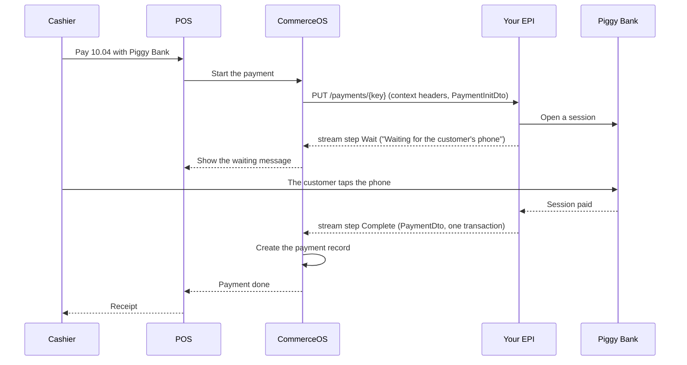
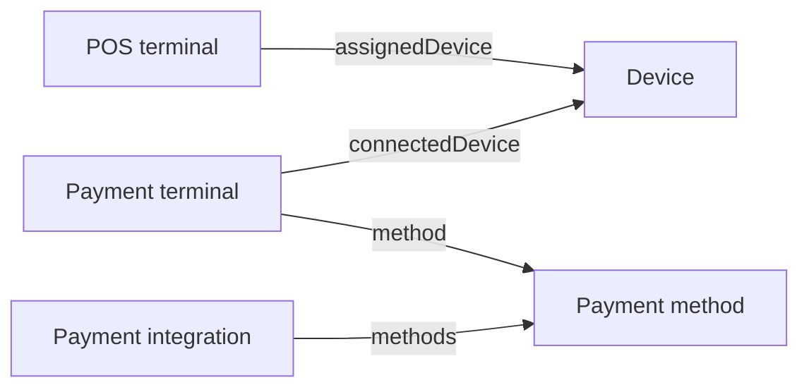

# Build a payment EPI

A payment EPI (External Partner Interface) is the HTTP service that you build so that CommerceOS
can take, capture, release and refund payments through your provider. This page gets you from
nothing to a working EPI in one sitting. The contract behind it is in
[Payment EPI reference](./payment-epi/reference.md).

**Base URL:** `https://example.app.heads.com/api/v1`
**API Key:** `banana` (passed via Basic Auth with empty username: `-u ":banana"`)

> **See also:** [Examples Index](../examples.md) | [Configuration](./configuration.md) § EPI Integrations

---

## 1. The picture

One sale, paid with a phone tap, from the cashier to the receipt.



CommerceOS starts every payment with one HTTP call to your EPI. The response is not one JSON
body. It is a stream of steps, one per line of progress. A `Wait` step tells the cashier what
happens. A `Complete` step ends the stream with the money that moved. CommerceOS turns each
transaction of that step into a payment record on the payment order. The receipt then closes.
Your EPI never calls the POS, and the POS never calls your EPI. Everything goes through
CommerceOS, and your EPI talks to your own provider in between. The rest of this page fills in
the calls.

## 2. Ten minutes

Piggy Bank is a sample EPI in three files, Node 22, no dependencies. Clone the repository and
start it.

```bash
git clone https://github.com/ByHeads/commerceos-api-reference.git
cd commerceos-api-reference/guide/examples/payment-epi/sample
node server.mjs
# Piggy Bank EPI at http://127.0.0.1:8787/piggy (tap and cancel window 3000 ms)
```

In a second terminal, play the CommerceOS side. The play script installs the EPI, reads the
methods, and starts one payment. It prints every step of the stream.

```bash
node play.mjs 10.00
# Method com.example.piggy (Piggy Bank)
# → Complete {"result":{"processorsId":"PB-1","methodId":"com.example.piggy","amount":"10.00","currencyCode":"SEK","transactions":[{"transactionId":"PB-2","actions":["Authorize","Debit"],"amount":"10.00","currencyCode":"SEK","methodId":"com.example.piggy","token":"tok-10.00","timestamp":"2026-09-18T20:13:28.756Z"}]}}
# transactionId  actions          amount  currencyCode  token      timestamp
# -------------  ---------------  ------  ------------  ---------  ------------------------
# PB-2           Authorize+Debit  10.00   SEK           tok-10.00  2026-09-18T20:13:28.756Z
```

Now the sale from the picture. An amount that ends in `.04` waits for the customer's phone. Start
the server with a longer window, so that you can tap by hand.

```bash
PIGGY_WAIT_MS=60000 node server.mjs      # first terminal
node play.mjs 10.04                      # second terminal
# Method com.example.piggy (Piggy Bank)
# → Wait {"message":"Waiting for the customer's phone","params":["PB-3"]}
#   tap:    curl -X POST http://localhost:8787/piggy/tap/PB-3
```

Run the tap command from a third terminal. The stream completes.

```bash
curl -X POST http://localhost:8787/piggy/tap/PB-3
# → Complete {"result":{"processorsId":"PB-3","methodId":"com.example.piggy","amount":"10.04","currencyCode":"SEK","transactions":[{"transactionId":"PB-4","actions":["Authorize","Debit"],"amount":"10.04","currencyCode":"SEK","methodId":"com.example.piggy","token":"tok-10.04","timestamp":"2026-09-18T20:13:30.317Z"}]}}
# transactionId  actions          amount  currencyCode  token      timestamp
# -------------  ---------------  ------  ------------  ---------  ------------------------
# PB-4           Authorize+Debit  10.04   SEK           tok-10.04  2026-09-18T20:13:30.317Z
```

The server log adds `kv pay-... not written`: the sample records the waiting session in the
CommerceOS key-value store, and no CommerceOS runs on your machine. That is expected.

## 3. What you build

Ten routes under one base URL. CommerceOS holds that base URL on a *payment integration* record
and appends a fixed path per call. A *bare* call carries no context headers. A *contextful* call
carries the three context headers of the reference, section 3. Reject one that arrives without them.

| Route | Kind | Answers |
|---|---|---|
| `POST /install` | bare | any 2xx. The body holds the OAuth2 client that your EPI uses to call CommerceOS back |
| `POST /uninstall` | bare | any 2xx |
| `GET /config-schema` | bare | a form description: the fields that an administrator fills in per store |
| `POST /test` | contextful | JSON `true` |
| `GET /methods` | contextful | the payment methods that you offer, `MethodDto[]` |
| `GET /terminals` | contextful | the terminals that this configuration knows, `TerminalDto[]` |
| `GET /terminals/{terminalId}` | contextful | one `TerminalDto` |
| `PUT /payments/{paymentKey}` | contextful | a stream of steps that ends in `Complete`, `Decline`, `Cancel` or `Fail` |
| `POST /payments/{paymentKey}/transactions` | contextful | one `TransactionDto`: a capture, a release or a refund |
| `POST /payments/{cancellationToken}/cancel` | contextful | any 2xx. The stream then ends with `Cancel` |

Calls go in two directions. CommerceOS calls your EPI for everything in the table. Your EPI
calls CommerceOS for three things, with the OAuth2 client from the install body: the configuration
behind a context id, a key-value store for your own state, and the completion of a payment that
ends asynchronously. The reference, section 8, lists them.

**Authentication of the calls into your EPI.** CommerceOS sends no credential on its calls to
your EPI. The three context headers identify the configuration, and nothing identifies the
caller. Protect the endpoint at the network level. How you do that is your choice.

## 4. A tour of the sample

| File | Role | Lines |
|---|---|---|
| `sample/bank.mjs` | the in-memory bank: sessions, a ledger, and `tap(sessionId)` for the customer's phone | 77 |
| `sample/server.mjs` | the EPI: the ten routes, the header check, the stream, transactions and cancel | 237 |
| `sample/play.mjs` | the CommerceOS side: install, methods, one payment, every step printed | 112 |

The header check. Every route below this line is contextful, so one test covers them all.

```js
// Section 3: every call below is contextful. Section 7 gives the error shape.
if (typeof request.headers["x-epi-context-config-id"] !== "string") {
    return json(response, 400, errorBody("Missing X-EPI-Context-Config-Id header"));
}
```

One step written to the stream. A step is one `event:` line, one `data:` line and a blank line.
The response stays open until the final step.

```js
const formatEvent = (type, data) => `event: ${type}\n${data == null ? "" : `data: ${JSON.stringify(data)}\n`}\n`;
// ...
response.writeHead(200, { "content-type": "text/event-stream", "cache-control": "no-cache" });
const send = (type, data) => response.write(formatEvent(type, data));
const complete = actions => send("Complete", { result: paymentResult(sessionId, [bank.settle(sessionId, actions)]) });
// ...
send("Wait", { message: "Waiting for the customer's phone", params: [sessionId] });
```

The transactions endpoint. A refund carries `reversalArgs`, so the bank credits the original
session instead of opening a new one.

```js
if ((match = /^POST \/payments\/([^/]+)\/transactions$/.exec(route))) {
    const dto = await readJson(request);
    const sessionId = sessionsByKey.get(decodeURIComponent(match[1]));
    if (!sessionId) return json(response, 404, errorBody(`No payment ${match[1]}`));
    if (dto?.methodId !== METHOD_ID) return json(response, 400, errorBody(`Unknown method ${dto?.methodId}`));
    const transaction = dto.reversalArgs ? bank.credit(sessionId, dto.amount) : bank.record(sessionId, dto.actions, dto.amount);
    return json(response, 200, transaction);
}
```

## 5. Connect it to CommerceOS

Five steps, each one curl. Before step 2, the integration needs a user with a confidential OAuth2
client, because `install` hands that client to your EPI. [Configuration](./configuration.md)
§ EPI Integrations shows that user. Replace `https://piggy.example.com/piggy` with the public
URL of your EPI.

```bash
# 1) Create the payment integration. name and baseUrl are required.
curl -X POST -u ":banana" "https://example.app.heads.com/api/v1/payment-integrations" \
  -H "Content-Type: application/json" \
  -d '{
    "identifiers": {"name": "Piggy"},
    "baseUrl": "https://piggy.example.com/piggy"
  }'
```

```bash
# 2) Install. CommerceOS calls POST {baseUrl}/install. On success the status becomes Active.
curl -X PATCH -u ":banana" "https://example.app.heads.com/api/v1/epi-integrations/name=Piggy" \
  -H "Content-Type: application/json" \
  -d '{"install": true}'
```

```bash
# 3) Create the EPI configuration on an organization node. Both references need database keys:
#   curl -X GET -u ":banana" "https://example.app.heads.com/api/v1/epi-integrations/name=Piggy/identifiers/key"
#   curl -X GET -u ":banana" "https://example.app.heads.com/api/v1/companies/com.heads.seedID=ourcompany/identifiers/key"
# The configuration object holds the fields that your /config-schema describes.
curl -X POST -u ":banana" "https://example.app.heads.com/api/v1/epi-configurations" \
  -H "Content-Type: application/json" \
  -d '{
    "identifiers": {"com.myapp.configId": "company-piggy-config"},
    "integration": {"identifiers": {"key": "<integration key>"}},
    "node": {"identifiers": {"key": "<node key>"}},
    "configuration": {"merchantId": "M-0001", "mode": "TEST"}
  }'
```

```bash
# 4) Configure. CommerceOS calls GET {baseUrl}/methods with the context of this node and
#    creates one payment method per item.
curl -X PATCH -u ":banana" "https://example.app.heads.com/api/v1/epi-configurations/com.myapp.configId=company-piggy-config" \
  -H "Content-Type: application/json" \
  -d '{"configure": true}'
```

```bash
# 5) Test. CommerceOS calls POST {baseUrl}/test once per configured node.
curl -X POST -u ":banana" "https://example.app.heads.com/api/v1/payment-integrations/name=Piggy/test" \
  -H "Content-Type: application/json" \
  -d 'true'
# → { "integrationName": "Piggy", "configurationTests": { "Our Company": "success" } }
```

**Terminals.** A payment method that requires a terminal reaches the POS through a chain of four
records. The arrows show which record points at which.



A POS terminal and a payment terminal meet only through the same device. There is no direct link
from a payment terminal to its integration. The link goes through the payment method. Each record
in the chain has an API resource, see [POS examples](./pos.md). In a test environment where your
key is read-only, a Heads administrator creates them: ask for a payment terminal when your method
requires one. CommerceOS reads `GET /terminals/{terminalId}` on your EPI when it creates its record.
`assignedTerminals` on the payment integration does not list terminals: it lists the organization
nodes that hold a configuration, and each node carries a `terminals` member that calls your EPI.

## 6. Test amounts

The conformance tool `epi-check` that Heads runs against your endpoint expects the cents of the
amount to select the outcome. The sample follows the same table.

| Cents | Outcome |
|---|---|
| `.00` | `Complete`, actions `["Authorize","Debit"]` |
| `.01` | `Decline`, reason `InsufficientFunds` |
| `.02` | `Fail`, one error |
| `.03` | `Cancellable`, then `Cancel` after the cancel call |
| `.04` | `Wait`, then `Complete` |
| `.05` | `Complete`, actions `["Authorize"]` only |

If your sandbox selects outcomes another way, tell Heads which amount produces each outcome. The
tool takes that mapping in a profile file.

## 7. Go live

- [ ] Your endpoint passes `epi-check`, every scenario.
- [ ] A contextful call without the three context headers gets a 4xx and an error body.
- [ ] `POST /test` answers per node: it reads the configuration of the context id and checks it.
- [ ] State lives in the CommerceOS key-value store or in your database, never only in memory.
- [ ] `POST /payments/{paymentKey}/transactions` is idempotent. A retry does not capture twice.
- [ ] Every stream ends with exactly one final step, also on an exception.
- [ ] Every call to your provider has a timeout, and a timeout ends the stream with `Fail`.
- [ ] You log the `X-EPI-Debug-Info` header on every contextful call.
- [ ] The base URL is `https://`, and the endpoint is protected at the network level (section 3).
- [ ] The `Decline` reasons that you use are listed for Heads, so the POS can translate them.

## 8. One family, two paths

A payment integration is one kind of EPI integration. Shipment, loyalty and wallet integrations
are the others, and they share the same base: a `baseUrl`, `install`, `uninstall`, and
configurations on organization nodes. The API exposes the family at `/v1/epi-integrations` and
each kind at its own path. A payment integration read through either path returns the same
record. `/v1/payment-integrations` adds the members that only a payment integration has, such as
`methods` and `assignedTerminals`. `install`, `uninstall` and `test` belong to the family and work
on both paths. Use `/v1/payment-integrations` for a payment provider. Use `/v1/epi-integrations`
only to list every integration kind at once.

## 9. Glossary

| Term | Meaning |
|---|---|
| EPI | External Partner Interface: an HTTP service that CommerceOS calls at a base URL plus fixed paths |
| payment integration | the CommerceOS record of one provider: a name, a `baseUrl`, a status, and its payment methods |
| EPI configuration | the values of one integration on one organization node, for example a merchant id. The form comes from `/config-schema` |
| context | the three headers on a contextful call. They name the configuration that the call runs under |
| organization node | a company, a store or another level of the organization tree. A configuration on a node applies to the nodes below it |
| payment order | what CommerceOS wants paid: an amount, a currency, a payer and a payee. Its key is the `paymentKey` of the stream call |
| payment record | one transaction on a payment order, created from one item of a `Complete` result or one `TransactionDto` |
| payment method | one way to pay that an integration offers, from `GET /methods`. The POS shows it as a button |
| payment terminal | the CommerceOS record of a physical or virtual terminal, linked to a payment method and a device |

## 10. Reference

The full contract, every field, and the fixtures that `epi-check` sends:
[Payment EPI reference](./payment-epi/reference.md).
