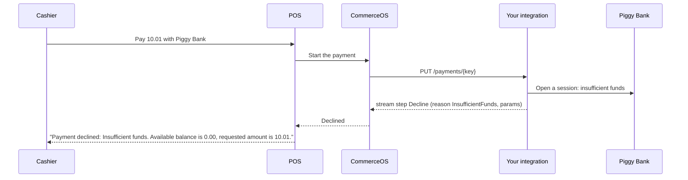
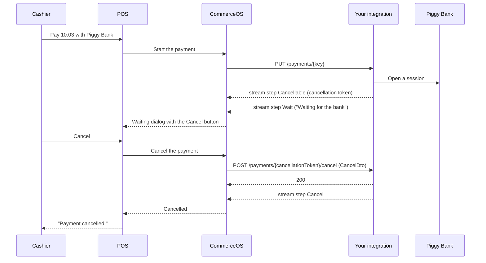
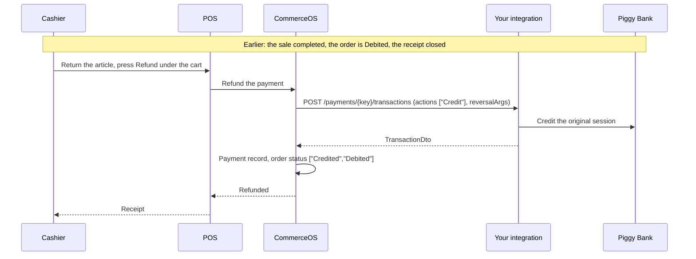
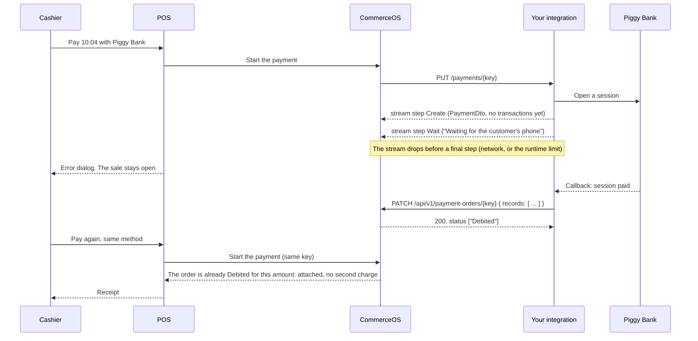
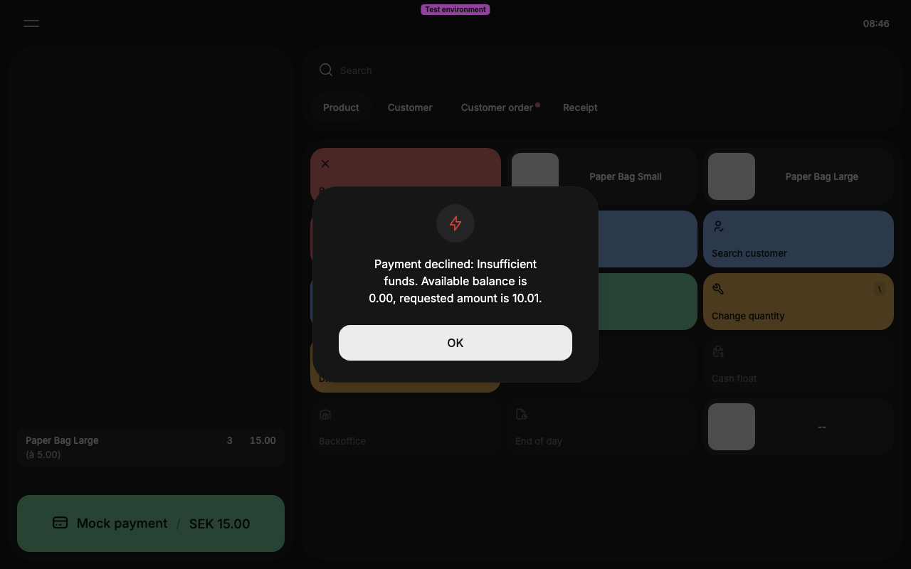
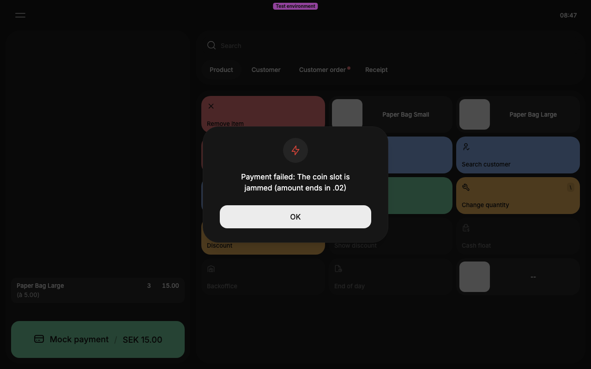
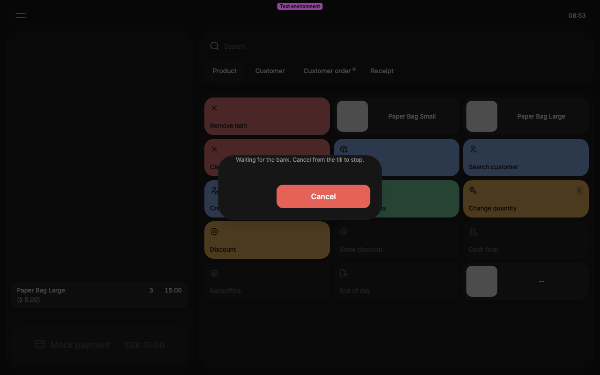
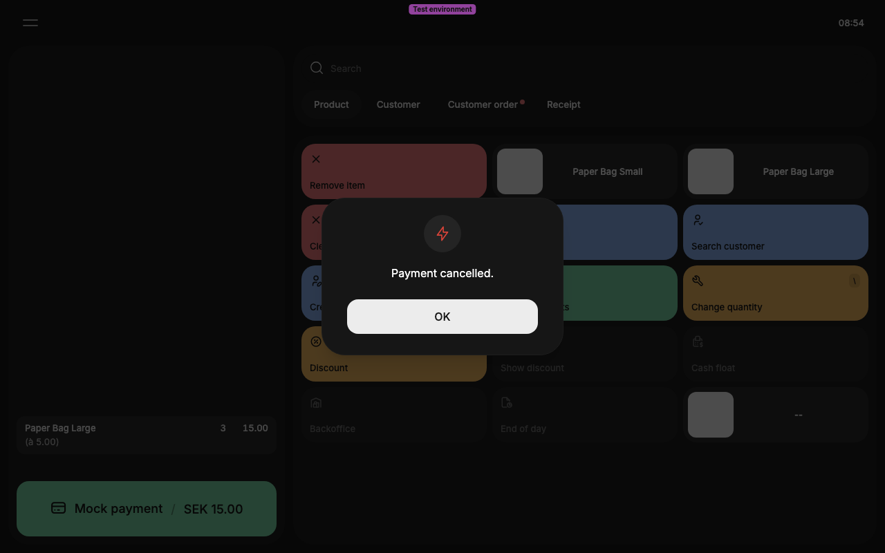
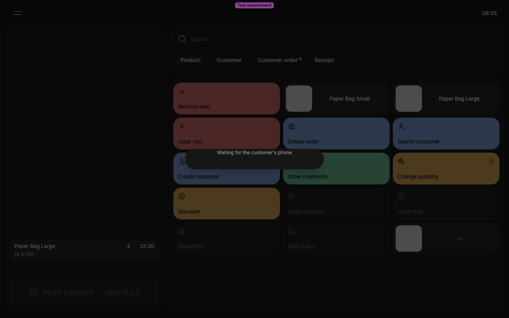

# Payment EPI: four more flows

The tutorial [Build a payment integration](../payment-epi.md) draws the sale that completes. These are the other
four outcomes that every payment integration meets, then a troubleshooting table. The Piggy Bank sample plays each one by its amount.

## 1. Decline (`10.01`)

A `Decline` is a normal negative outcome, not an error. The POS shows one sentence in the cashier's
language when the `reason` is in the translated list (reference, section 9), and `Payment declined: <your code>`
for any other code. `params` fill the `{0}`, `{1}` of that sentence: `InsufficientFunds` needs two.
The sale stays open on the till, and the cashier chooses another method or cancels the sale. No payment record is created.

## 2. Cancel from the till (`10.03`)

The Cancel button sits on the `Wait` dialog, so `Cancellable` alone shows the cashier nothing. The cancel
call runs in parallel with the stream; the button does not close the payment, your `Cancel` step does.
A non-2xx answer shows `Cancel failed: <code>: <message>` and leaves the stream and the button as they were.
In self-checkout mode a `Cancel` step also locks the terminal for a supervisor.

## 3. Refund of a completed sale

A refund is one `TransactionInitDto` with `actions: ["Credit"]` and `reversalArgs` that name the
original transaction and its timestamp (reference, section 6). `amount` is positive. Answer a
`TransactionDto` with your own `transactionId`, and CommerceOS adds one payment record to the same order, so its status gains `Credited`.
The *Refund* button first opens a confirmation dialog that lists your method once per payment line of
the receipt, each with an amount that the cashier can change, so a `Credit` for part of a payment can
reach you, and one confirmation makes one Credit call per payment order on that receipt, each with
its own `reversalArgs`. CommerceOS makes each call once and does not retry: a non-2xx with an error body shows your `<code>: <message>` as the dialog text, and the cashier starts the refund again by hand.

This flow runs only from the *Refund* action under the cart, and only for a method with
`supports.reversal`. A cashier who returns the article, opens the pay screen and picks your method
for the negative balance starts a **new payment** instead: `PUT /payments/{key}` with
`direction: "Payout"` and `debitSynchronously: true`, on a new key, and your integration answers it
like a sale, with `["Authorize","Debit"]`. The reference, section 6, gives the rule that chooses
between the two.

On the till, the *Refund* action is the button under the cart that replaces *Pay* once the cart holds
a return of a receipt that your method paid: *Kvitto*, open the receipt, *Returnera allt*, pick a
reason, *Skapa*, then the button reads `Återbetalning <your method> / −<amount>`. A non-2xx on the
transactions call shows `<code>: <message>` from your error body verbatim: unlike a `Fail` step, no
code is translated on this route.

## 4. Asynchronous completion

Send `Create` before `Wait` when a payment can complete asynchronously: the payment order exists from
that step, and the completion is `PATCH /v1/payment-orders/{key}` (`commerceos-openapi.yaml` says what it
accepts and refuses). What CommerceOS does when the cashier pays again: reference, section 11. The
conformance amount `.04` is the synchronous case: it expects `Wait` then `Complete`, without `Create`.

## What the cashier sees

Captures from a manned till with Piggy Bank installed: one line of 15.00, paid in part with the test amounts.

| Step | Capture |
|---|---|
| `Decline` (`10.01`) |  |
| `Fail` (`10.02`) |  |
| `Cancellable` then `Wait` (`10.03`) |  |
| `Cancel`, after the cashier pressed Cancel |  |
| `Wait` (`10.04`) |  |

## Troubleshooting

| Symptom | Cause | Fix |
|---|---|---|
| The cashier sees `Payment failed: <text>` | A `Fail` step. Only `errors[0]` is shown, as `message` or the translation of its `code` | Put the sentence for the cashier in `errors[0].message` |
| The cashier sees `¿Error: Request failed: <status>.?` | Your integration answered a non-2xx on the stream route. CommerceOS discards the body there | Answer a 200 stream with one `Fail` step (reference, section 7) |
| The cashier sees nothing after picking your method, and the sale stays open | The stream closed with no final step | End every stream with a final step, also on an exception |
| The cashier sees `¿TypeError: terminated?` | The connection dropped before a final step | Keep the connection open until the final step, and send a `Wait` step at intervals while you wait |
| After every closed receipt: `Utskriftskonfigurationen är inte komplett.` (the printing configuration is incomplete) | The terminal has no receipt printer. A local test environment, not your integration | Ignore it, or give the terminal a printer |
| The cashier sees a raw transport error, not one of the payment texts | The stream dropped before a final step, or the call answered a non-2xx without an error body | End every stream with a final step, also on an exception. Answer an error body (reference, section 7) on a non-2xx |
| The cashier sees `Payment declined: MyCode` in English on a Swedish till | The `reason` is not in the translated list | Use a code from reference, section 9, or accept the generic text |
| The waiting dialog never ends | The stream sent no final step | Give every provider call a timeout, and end the stream with `Fail` on it |
| The stream stops after about five minutes | The HTTP runtime of CommerceOS closes a stream with no bytes for that long | Send a `Wait` step at intervals while you wait |
| `POST /payments/{key}/transactions` answers 404 from your integration | Your integration lost the session behind `paymentKey` after a restart | Keep the session in the key-value store or your database (reference, section 8), not only in memory |
| `PATCH /v1/payment-orders/{key}` answers 400 with details `Payment order not found.` | The stream sent no `Create` or `Complete` step before it dropped | Send `Create` as the first step of an asynchronous payment |
| `PATCH /v1/payment-orders/{key}` answers 400 `Amount must agree with designated instance.` | A `Debit` or `Authorize` beyond what the order still allows, for example a completion posted twice with two ids | Post the completion once, with one `transactionId` |
| `GET /v1/payment-integrations/...` or `GET /v1/payment-terminals` fails with the token of your integration | The OAuth2 client of your integration cannot read payment integrations or payment terminals. Only an administrator key can | Ask Heads for the record that you need. Your integration needs only the calls in reference section 8 |
