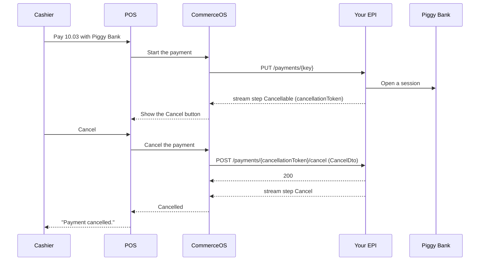
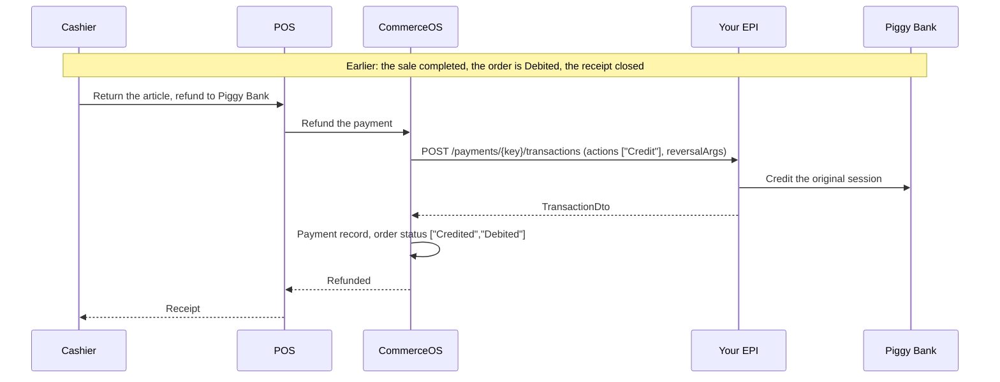
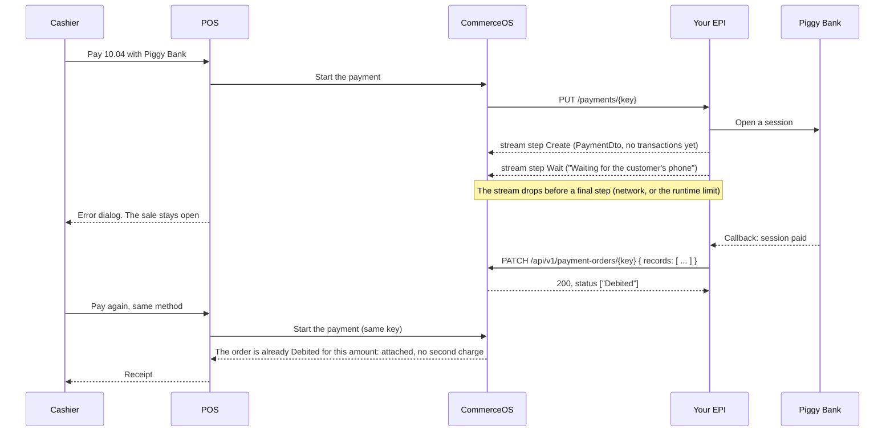

# Payment EPI: four more flows

The tutorial [Build a payment EPI](../payment-epi.md) draws the sale that completes. These are the other
four outcomes that every EPI (External Partner Interface) meets, then a troubleshooting table. The Piggy Bank sample plays each one by its amount.

## 1. Decline (`10.01`)

A `Decline` is a normal negative outcome, not an error. The POS shows one sentence in the cashier's
language when the `reason` is in the translated list (reference, section 9), and
`Payment declined: <your code>` for any other code. `params` fill the `{0}`, `{1}` of that sentence:
`InsufficientFunds` needs two. The sale stays open on the till, and the cashier chooses another
method or cancels the sale. No payment record is created.

## 2. Cancel from the till (`10.03`)

The Cancel button appears only after a `Cancellable` step, and only while the stream is open. The
cancel call is a second request, in parallel with the stream, and CommerceOS makes it once. Answer
2xx, then end the stream with `Cancel`: the button does not close the payment, the final step does. A
non-2xx answer shows `Cancel failed: <message>` and leaves the stream and the button as they were.
In self-checkout mode a `Cancel` step also locks the terminal for a supervisor.

## 3. Refund of a completed sale

A refund is one `TransactionInitDto` with `actions: ["Credit"]` and `reversalArgs` that name the
original transaction and its timestamp (reference, section 6). `amount` is positive. Answer a
`TransactionDto` with your own `transactionId`, and CommerceOS adds one payment record to the same
order, so its status gains `Credited`. CommerceOS makes this call once and does not retry: a
non-2xx shows `Payment failed: <message>`, and the cashier starts the refund again by hand.

## 4. Asynchronous completion

The payment order exists from the first `Create` or `Complete` step, so send `Create` before `Wait`:
`PATCH /v1/payment-orders/{key}` answers `Payment order not found.` for a key that saw neither. The
record needs the members of reference, section 8. When the cashier pays again, CommerceOS finds the
order `Debited` for the tender amount and attaches it to the sale without a new call to your EPI. A
record with a `transactionId` that CommerceOS already holds is ignored, so a repeated callback is safe.

## Troubleshooting

| Symptom | Cause | Fix |
|---|---|---|
| The cashier sees `Payment failed: <text>` | A `Fail` step. Only `errors[0]` is shown, as `message` or the translation of its `code` | Put the sentence for the cashier in `errors[0].message` |
| The cashier sees a raw transport error, not one of the payment texts | The stream dropped before a final step, or the call answered a non-2xx without an error body | End every stream with a final step, also on an exception. Answer an error body (reference, section 7) on a non-2xx |
| The cashier sees `Payment declined: MyCode` in English on a Swedish till | The `reason` is not in the translated list | Use a code from reference, section 9, or accept the generic text |
| The cashier sees `Please wait ...` instead of your message | A `Wait` step without `message` and without `translationKey` | Send `message` |
| The waiting dialog never ends | The stream sent no final step | Give every provider call a timeout, and end the stream with `Fail` on it |
| The stream stops after about five minutes | The HTTP runtime of CommerceOS closes a stream with no bytes for that long | Send a `Wait` step at intervals while you wait |
| `POST /payments/{key}/transactions` answers 404 from your EPI | Your EPI lost the session behind `paymentKey` after a restart | Keep the session in the key-value store or your database (reference, section 8), not only in memory |
| `PATCH /v1/payment-orders/{key}` answers `Payment order not found.` | The stream sent no `Create` or `Complete` step before it dropped | Send `Create` as the first step of an asynchronous payment |
| `PATCH /v1/payment-orders/{key}` answers 400 `Amount must agree with designated instance.` | A `Debit` or `Authorize` beyond what the order still allows, for example a completion posted twice with two ids | Post the completion once, with one `transactionId` |
| `GET /v1/payment-integrations/.../assignedTerminals` answers 500 on a test environment | A known defect on the CommerceOS side | Ask Heads. `GET /terminals` on your EPI is not involved |
